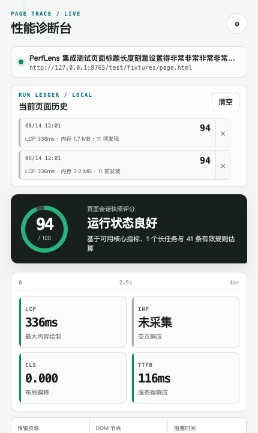

<div align="center">

# PerfLens

**Capture evidence from a real Chrome session, carry it into code as a versioned audit package, and verify the next browser run.**



[](https://github.com/Jinchengawu/AI-Web-Performance-Plugin/actions/workflows/ci.yml)
[](#project-status)
[](./manifest.json)
[](./LICENSE)

[English](./README.md) · [简体中文](./README.zh-CN.md)

</div>

## Project status

> **Alpha.** The Chrome extension is browser-tested, the VS Code extension is logic-tested, and the Codex plugin has been validated as a local package. Cursor uses the VS Code extension surface but has not been tested independently. The current UI is Chinese-only.

The source tree and Chrome extension are at `0.4.0`. The latest public release is [`v0.3.0`](https://github.com/Jinchengawu/AI-Web-Performance-Plugin/releases/tag/v0.3.0), which contains the `0.1.0` VSIX. Build the editor extension from source when you need the current repository code.

PerfLens is not a Lighthouse replacement. It records the browser session you are actually using; Lighthouse remains useful for controlled lab throttling and repeatable synthetic audits.

## The loop

```text
Real Chrome session
  → Performance Snapshot + 43-rule deterministic audit
  → optional AI Optimization Plan
  → versioned Audit Package (.json)
  → reviewed changes in Codex or VS Code
  → Fix Session (.json)
  → Chrome recapture
  → metric and finding comparison
```

The JSON package preserves report IDs, finding IDs, environment evidence, verification commands, and result hashes across tools. A local build or test can show that a change is compatible; only the Chrome recapture can show whether runtime metrics changed.

| Surface | Role | Verification as of 2026-08-14 |
|---|---|---|
| Chrome extension | Measure, audit, persist history, export, and compare | Browser-tested with Playwright Chromium |
| Codex plugin | Map package evidence to source, apply scoped fixes, run checks, export a Fix Session | Package and CLI command surface locally validated |
| VS Code extension | Import findings, generate uniquely anchored patches, review, apply, and export | Logic-tested; VS Code engine `^1.90.0` |
| Cursor | Use the VS Code extension API surface | Expected compatible; not independently tested |

## Quick start: first evidence in five minutes

The first result needs no build step, API key, or model account.

```bash
git clone https://github.com/Jinchengawu/AI-Web-Performance-Plugin.git
cd AI-Web-Performance-Plugin
```

1. Open `chrome://extensions`.
2. Enable **Developer mode**.
3. Select **Load unpacked** and choose the repository root.
4. Refresh the `http://` or `https://` page you want to inspect.
5. Open PerfLens and click **采集性能快照** (Collect performance snapshot).

You should see a page score, the currently available LCP/INP/CLS/TTFB values, deterministic audit coverage, memory evidence, environment context, and one new local history entry. AI diagnosis is optional.

### If the first capture is incomplete

- Chrome internal pages cannot be injected; use a normal `http(s)` page.
- Refresh the target page after loading the extension so observers start at navigation time.
- INP remains unavailable until the page receives a qualifying interaction.
- LCP can be unavailable when the extension starts after the relevant navigation; reload and capture again.
- Renderer memory is optional and unavailable on unsupported Chrome channels. JS Heap and page-memory evidence continue to work when available.

## Complete the browser-to-code loop

### 1. Create an Audit Package

After a capture, you can export the deterministic report immediately. To add an AI-generated Optimization Plan, choose a provider, configure its endpoint/model, add an API key when required, and click **大模型诊断** (AI diagnosis).

Click **结构化 JSON** (Structured JSON) to download the versioned `perflens.audit-package`. Imported Lighthouse/PageSpeed JSON, HTML, Markdown, CSV, TXT, and generic JSON can be attached as additional untrusted evidence; each file is limited to 2 MB and at most eight attachments are accepted.

### 2A. Repair with the Codex plugin

The following commands were verified locally with Codex CLI `0.147.0-alpha.6.5` on 2026-08-14. Plugin CLI syntax is version-sensitive.

```bash
codex plugin marketplace add Jinchengawu/AI-Web-Performance-Plugin
codex plugin add perflens@perflens
```

Start a new Codex task, then invoke the bundled Skill:

```text
Use $perflens-optimize to import /absolute/path/perflens-audit.json,
implement the safe P0/P1 fixes, run verification, and export a Fix Session.
```

The Skill treats report contents as untrusted evidence, traces selected findings into the repository, keeps static verification separate from runtime claims, and records remaining uncertainty. Plugin source: [`plugins/perflens/`](./plugins/perflens/).

### 2B. Repair with VS Code

The published [`perflens-optimizer-0.1.0.vsix`](https://github.com/Jinchengawu/AI-Web-Performance-Plugin/releases/download/v0.3.0/perflens-optimizer-0.1.0.vsix) belongs to release `v0.3.0` and has SHA-256:

```text
3ba0e4e42379a4d7b6161aea443b48d02a192ad356cd590188376a4ff792a39a
```

For the current repository code:

```bash
cd editor-extension
npx @vscode/vsce package
```

Install the VSIX with **Extensions: Install from VSIX…**, open the target repository, and run **PerfLens: 导入结构化报告**. The extension stores keys in VS Code SecretStorage, rejects workspace-external paths and ambiguous source matches, and requires patch selection plus modal confirmation before applying changes. Suggested terminal commands are displayed, not executed.

### 3. Recapture and compare

Export a Fix Session from Codex or VS Code. Back in Chrome:

1. Import the baseline Audit Package and the Fix Session with **导入报告**.
2. Refresh the changed page and repeat the relevant interaction.
3. Click **采集性能快照** again.
4. Inspect metric deltas and resolved, new, and remaining finding IDs.

## What PerfLens measures

### Performance and runtime

- Core Web Vitals: LCP, high-percentile INP, and CLS session windows
- Navigation: redirects, DNS, TCP, TLS, request/TTFB, download, FCP, DOMContentLoaded, and Load
- Main thread: Long Tasks, estimated Total Blocking Time, Long Animation Frames, and script attribution
- Resources: waterfall, transfer/decoded size, compression, cache signals, protocol, largest/slowest resources, and third-party origins
- Page shape: DOM count/depth, images, scripts, stylesheets, forms, links, and LCP element attribution

### Memory and environment

- JS Heap samples, peak, delta, growth slope, monotonic-growth ratio, and observation duration
- `measureUserAgentSpecificMemory()` when the document is secure, cross-origin isolated, and supported
- Optional renderer `privateMemory` through Chrome's [`processes`](https://developer.chrome.com/docs/extensions/reference/api/processes) permission; the API is currently documented for the Dev channel
- Browser/OS versions, CPU count, device-memory hint, viewport, DPR, network type, downlink, RTT, Save-Data, protocol, timezone, and isolation state

Memory scopes are not interchangeable. A high footprint is not proof of a leak. The trend classifier requires at least five usable samples spanning 30 seconds, and its result only narrows the investigation; DevTools Heap Snapshots and retained-object paths remain necessary for root-cause analysis.

### Deterministic quality audit

PerfLens implements 43 rules across performance, memory, SEO, accessibility, security, and engineering quality. Coverage is reported as evaluated, passed, failed, or unavailable so an unsupported check is not silently counted as a pass.

## Model adapters

These are configurable source defaults as of 2026-08-14, not a promise that a model is enabled for every provider account. No live provider call is part of the repository test suite.

| Preset | Default endpoint | Default model | Protocol |
|---|---|---|---|
| OpenAI | `https://api.openai.com/v1` | `gpt-5.6-luna` | Responses API |
| DeepSeek | `https://api.deepseek.com` | `deepseek-v4-flash` | Chat Completions |
| Anthropic | `https://api.anthropic.com` | `claude-opus-4-8` | Messages API |
| OpenAI-compatible | Custom | Custom | Chat Completions |

All adapters normalize provider output into the same Optimization Plan shape. Change the model or endpoint when availability differs. An OpenAI-compatible endpoint stays on-device only when the configured endpoint itself is local.

## Protocol and repository layout

`perflens.audit-package` uses schema major version `1`. The editor and Codex inspector reject malformed packages and unsupported major versions. Markdown is a readable adapter; JSON is the cross-surface source of truth. See [ADR-0001](./docs/adr/0001-portable-audit-package.md).

```text
probes/                 Performance observers, snapshot, memory, and deterministic audits
shared/                 Report protocol, evidence intake, history, and baseline comparison
background.js           Model-provider adapters and structured diagnosis
popup.*                 Chrome UI adapter
editor-extension/       VS Code repair adapter
plugins/perflens/       Codex plugin and perflens-optimize Skill
docs/adr/               Architecture decisions
test/                   Unit fixtures and real-browser integration tests
```

## Privacy, permissions, and data movement

The Chrome extension declares `activeTab`, `storage`, and `scripting`, injects on `http(s)` pages, and therefore requests host access to those pages. Renderer process memory uses a separate optional permission.

| Surface | Stored locally | Sent only after user action | Exported / boundary |
|---|---|---|---|
| Chrome | Provider settings and bounded report history in `chrome.storage.local`; API keys are stored there for local-development convenience | AI diagnosis sends the sanitized snapshot, audits, coverage, up to five history summaries, and up to eight attachment bodies within a 160k-character budget to the configured endpoint | Query strings/fragments are removed from stored page identity; keys are not exported. History keeps 20 runs per page and 120 globally, pruning near 7 MB |
| VS Code | API key in SecretStorage; settings and pending state in the extension host | Patch generation sends the plan, `package.json`, and ranked source context—up to 12 files/160k characters by default—to the configured endpoint | Fix Session records paths, reasons, finding IDs, verification, and hashes, not keys or source bodies |
| Codex | Reads the selected package and workspace inside the active Codex environment; the plugin has no separate API key or MCP server | Source handling follows the active Codex host, account, and model policy | Fix Session records paths, reasons, finding IDs, hashes, and verification; a local package does not imply offline execution |

Imported reports, page text, resource names, and source code are untrusted data, not instructions. Before public or organization-wide distribution, use a backend token broker, short-lived credentials, rate limits, consent, retention controls, and cost auditing. Read [`SECURITY.md`](./SECURITY.md).

## Compatibility

| Surface / input | Status | Scope |
|---|---|---|
| Chrome MV3 | ✅ Browser-tested | `http(s)` pages; internal browser pages excluded |
| Codex plugin | ✅ Locally validated | CLI `0.147.0-alpha.6.5`; manifest, Skill, and package tests |
| VS Code | ✅ Logic-tested | Engine `^1.90.0`; no Extension Host E2E yet |
| Cursor | ◐ Inferred compatibility | Uses VS Code APIs; not independently tested |
| Lighthouse/PageSpeed JSON | ✅ Fixture-tested | Normalized as external evidence |
| HTML/Markdown/CSV/TXT/generic JSON | ✅ Implementation-tested | 2 MB per file; up to eight attachments |

## Development and verification

CI uses Node `22`. The audit baseline on 2026-08-14 used Node `22.17.1`, npm `10.9.2`, Python `3.9.6`, and Playwright `1.58.2`.

```bash
npm ci
npx playwright install chromium

# Syntax, protocol, model-adapter, history, memory, editor, and plugin tests
npm test

# Load the real MV3 extension and exercise the browser workflow
npm run test:browser
```

The browser suite uses an isolated Chromium profile and a local fixture. Provider tests use mocked responses and do not establish account availability or live API behavior.

## Known limits

- The Chrome UI is currently Chinese-only.
- A live session snapshot is not a CPU/network-throttled Lighthouse lab run.
- Single-device results do not establish field performance or user impact.
- INP requires interaction; cross-origin resources can hide timing/size without `Timing-Allow-Origin`.
- Page-memory estimation requires browser support and a secure, cross-origin-isolated document.
- Renderer private memory depends on the optional Dev-channel `processes` API and can include shared renderer work.
- The memory classifier suggests risk; it does not diagnose retained objects or prove a leak.
- Editor repair uses unique text replacement. AST/codemod repair is not implemented.
- Cursor compatibility and live model-provider calls have not been independently verified.
- No performance improvement should be inferred until the changed page is recaptured under a comparable workload.

## Planned, not current

- AST/codemod repair adapters
- Automatic baseline-to-recapture association in the editor workflow

## Contributing

Issues and pull requests are welcome. Read [`CONTRIBUTING.md`](./CONTRIBUTING.md) before changing probes, protocol fields, provider adapters, or repair behavior. Include the user impact, verification evidence, tests for behavior changes, and browser coverage when collection or export behavior changes. Never commit live API keys, private reports, source context, or customer data.

## License

[MIT](./LICENSE) © [Jinchengawu](https://github.com/Jinchengawu) and PerfLens contributors.
